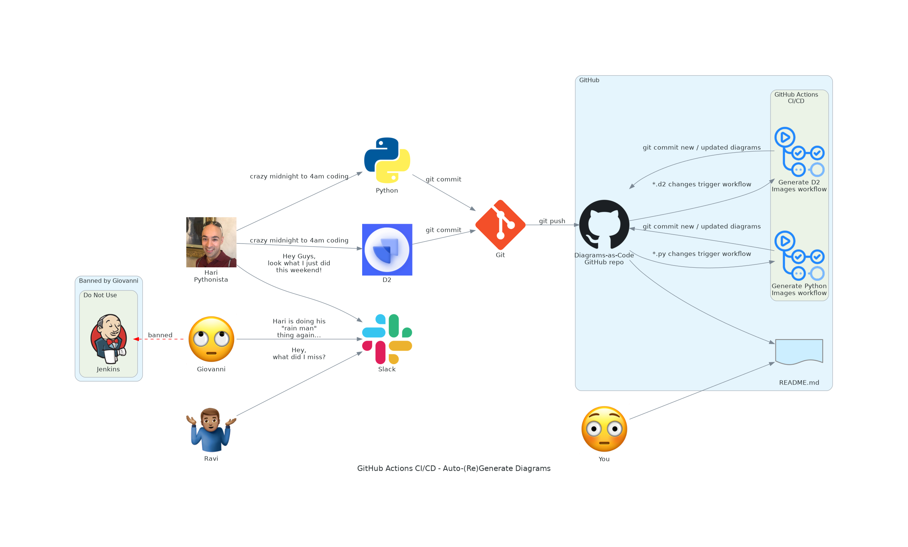
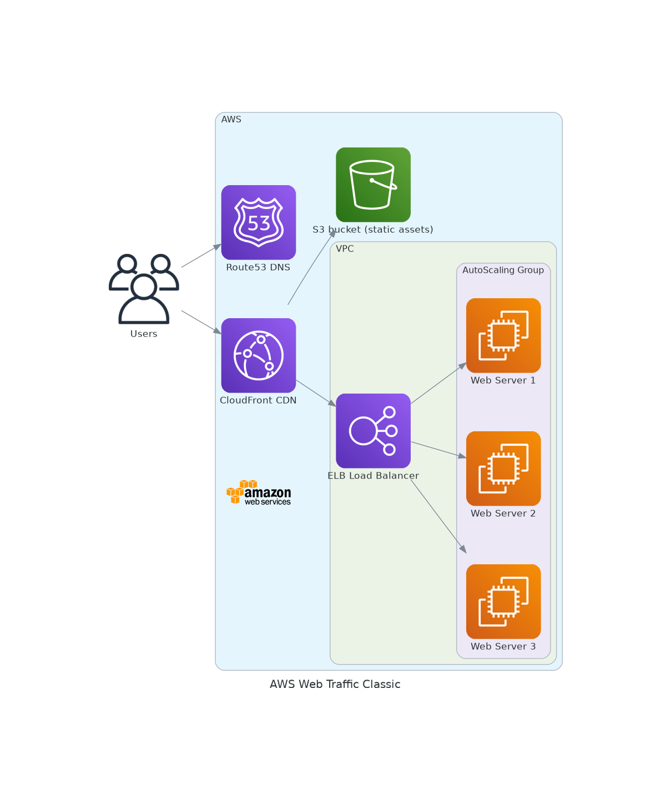
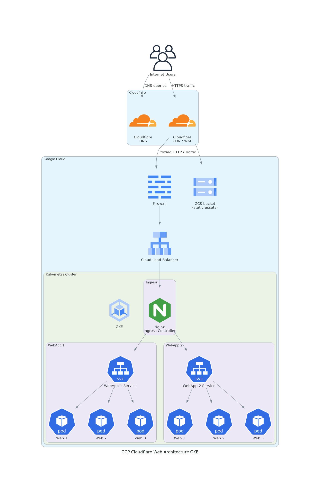
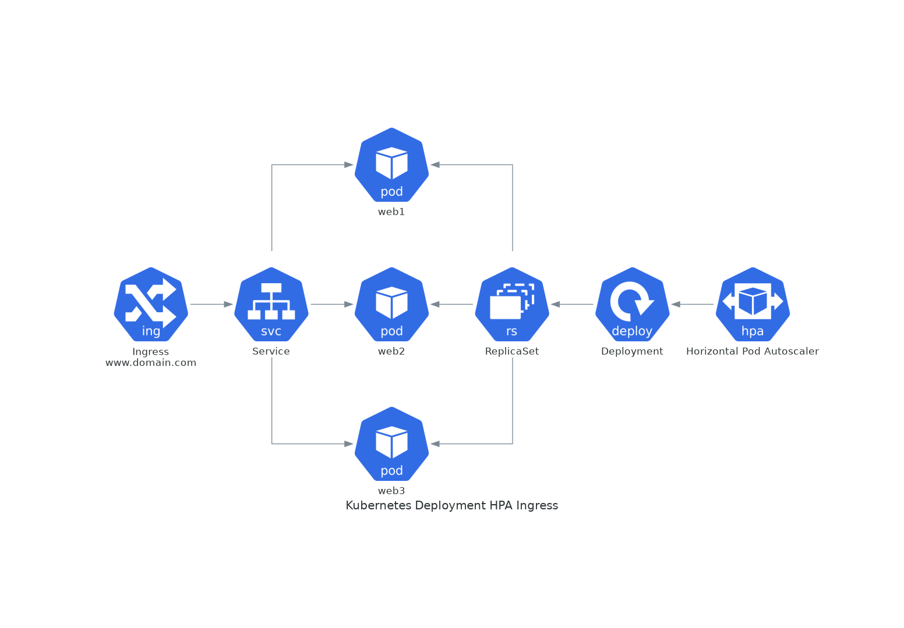
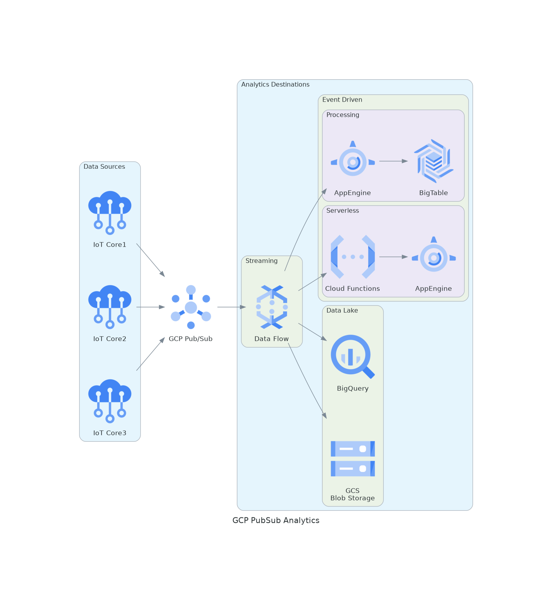

# Hari Sekhon - Diagrams-as-Code

[](https://github.com/HariSekhon/Diagrams-as-Code/stargazers)
[](https://github.com/HariSekhon/Diagrams-as-Code/network)
[](https://github.com/HariSekhon/Diagrams-as-Code#Hari-Sekhon---Diagrams-as-Code)
[](https://github.com/HariSekhon/Diagrams-as-Code/blob/master/LICENSE)
[](https://github.com/HariSekhon/DevOps-Bash-tools#hari-sekhon---devops-bash-tools)
[](https://github.com/HariSekhon/DevOps-Bash-tools#hari-sekhon---devops-bash-tools)
[](https://github.com/HariSekhon/Diagrams-as-Code/commits/master)

[](https://www.codacy.com/gh/HariSekhon/Diagrams-as-Code/dashboard)
[](https://www.codefactor.io/repository/github/harisekhon/Diagrams-as-Code)
[](https://github.com/HariSekhon/Diagrams-as-Code/actions/workflows/sonarcloud.yaml)
[](https://sonarcloud.io/dashboard?id=HariSekhon_Diagrams-as-Code)
[](https://sonarcloud.io/dashboard?id=HariSekhon_Diagrams-as-Code)
[](https://sonarcloud.io/dashboard?id=HariSekhon_Diagrams-as-Code)
[](https://sonarcloud.io/dashboard?id=HariSekhon_Diagrams-as-Code)
[](https://sonarcloud.io/summary/new_code?id=HariSekhon_Diagrams-as-Code)

[](https://harisekhon.github.io/CI-CD/)
[](https://dev.azure.com/harisekhon/GitHub/_build/latest?definitionId=14&branchName=master)
[](https://gitlab.com/HariSekhon/Diagrams-as-Code/pipelines)
[](https://bitbucket.org/HariSekhon/Diagrams-as-Code/addon/pipelines/home#!/)

[](https://dev.azure.com/HariSekhon/GitHub/_git/Diagrams-as-Code)
[](https://github.com/HariSekhon/Diagrams-as-Code)
[](https://gitlab.com/HariSekhon/Diagrams-as-Code)
[](https://bitbucket.org/HariSekhon/Diagrams-as-Code)

[](https://github.com/HariSekhon/Diagrams-as-Code/actions/workflows/generate-d2-images.yaml)
[](https://github.com/HariSekhon/Diagrams-as-Code/actions/workflows/generate-python-images.yaml)
[](https://github.com/HariSekhon/Diagrams-as-Code/actions/workflows/d2-fmt.yaml)
[](https://github.com/HariSekhon/Diagrams-as-Code/actions/workflows/validate.yaml)
[](https://github.com/HariSekhon/Diagrams-as-Code/actions/workflows/kics.yaml)
[](https://github.com/HariSekhon/Diagrams-as-Code/actions/workflows/grype.yaml)
[](https://github.com/HariSekhon/Diagrams-as-Code/actions/workflows/semgrep.yaml)
[](https://github.com/HariSekhon/Diagrams-as-Code/actions/workflows/semgrep-cloud.yaml)
[](https://github.com/HariSekhon/Diagrams-as-Code/actions/workflows/sonarcloud.yaml)
[](https://github.com/HariSekhon/Diagrams-as-Code/actions/workflows/trivy.yaml)

[](https://app.diagrams.net/?splash=0&ui=dark&libs=aws3;aws3d;aws4;azure;gcp2;network;webicons)
[](https://app.diagrams.net/?splash=0&ui=dark&libs=aws3;aws3d;aws4)
[](https://app.diagrams.net/?splash=0&ui=dark&libs=azure)
[](https://app.diagrams.net/?splash=0&ui=dark&libs=gcp2)
[![LucidChart](https://img.shields.io/badge/LucidChart-editor-orange.svg?logo=data:image/png;base64,iVBORw0KGgoAAAANSUhEUgAAAOEAAADhCAMAAAAJbSJIAAAAllBMVEX////5axP5ZAD//Pr8tZb8vqf5bhX8uZb5ZwD5aQ35aAj5YgD/+/j+7+f92cf+5NT5XAD+9/H6kVj6hkj+7eT+9O38xan91cH8tpH7mmf5eSn8v6L90Lf7lmP7n2z5cB/8rX76cAv8r4n6gDv6i1T7pXX5hj39zbX6hET8xqf94M37kVL6pnL+6d35gjf6ejH7pn76mVvxCTe5AAADaklEQVR4nO3dfVOiUBTHcS8UXC6CISD4SKJm4dra+39zm7vtrsmjM5n3nPl9/z/FZ1CIJk+9HkIIIYQQQgghhBBCCCGEEEI0i4NbH8F1M/3x6NbHcNUGd5OH+1sfxBULpqHhuHyF5myeKSH4CqNFphzBWPgo5dHHVRjMlq74iKMw8OeGIxgL/XxiCMFXGNmrkxPIT2i+rC0lBF9hMc6kEHyF3sZSzjmQkTC2l0bZx0cYF09ulY+L0PQ3svQG5CQcpCtZfQJ5CPt2qFSdj4Nwti7fITgJo7lV/wJlIIxz2eKjLfS2z24Lj7Qw8IduwwWGvrD4/IzEThjZz61vQNLC8jMSL2Gxq3qG4CMMfjx0fYGSFMZ21u0CQ1Y4rXlGYiM07y48gxBqF4QQ6h+EEOofhBDqH4QQ6h+EEOofhBDqH4QQ6h+EEOofhBDqH4QQ6h+EEOofhBDqH4QQ6h+EEOofhBDqH4QQ6h+EEOofhBDqH4RfJDS//sg7f+vvEJqJfzvidwj3+eSOs9BMQ+VyFiZDoYTBV7ify+Onb9kKo3z556szFXrb17+f3mQp7Cdj+e/j4QyFpp//PFmQwk8YpKtPH39nJ7TDs/0FzIT78oYiVkJvY5Q3FDESRqNV1YYbNsIg2RmVC0S4CP2DVbNCi4dw37DjjYOwPw2t+gUbDIRJKJo2+FAXmvHbQ/OGIuLCKF027uijLvS26/YNRZSFs0XrCSQtHBy67XijKgzSrjveiApnz413COpCc/AmO++wIyg0443b4QJDVxiPXjtsASUrlNlh0bRmmLrQMYZJftkJpCU0JiOvd89XKN2F9z7DVqjkcPB7hqlQOeHLxwxLoSNXafx3hqPQmByK/zP8hFLOZ/2TGW5Cxwi33qcZZkIpc+9shpPQUe5uX5phJFRiN6uYYSN0RGhX/kNOLkJjkg6qZ3gIpdwkdTMchMc7RFw7w0BoZNPzO8Rp5IXKHZfvEKcRFyrx1OwjLlTW2u63zRAWvj8jlX5Eq4iuUGaHovUE9ugKHeMtqb9DnEZT6LjH36J1i6LQkcvHqPMMQaG0hjU/glZ2ufDGf8munHXVM1J999K6MHlToRvmXS6gJxWpfWGpf52j75I5PVzyAiWYGVU+5CKEEEIIIYQQQgghhBBCCCGEEEIIIYQQQgjx7RfeAUw4ubZ1NgAAAABJRU5ErkJggg==)](https://lucid.app/)
[](https://app.cloudcraft.co/)
[](https://app.creately.com/d/start/dashboard)
[](https://online.visual-paradigm.com/drive/#diagramlist:proj=0&dashboard)

[](https://d2lang.com/)
[![MermaidJS](https://img.shields.io/badge/Mermaid-JS-FF3399.svg?logo=data:image/svg%2bxml;base64,PD94bWwgdmVyc2lvbj0iMS4wIiBlbmNvZGluZz0iVVRGLTgiIHN0YW5kYWxvbmU9Im5vIj8+CjwhRE9DVFlQRSBzdmcgUFVCTElDICItLy9XM0MvL0RURCBTVkcgMS4xLy9FTiIgImh0dHA6Ly93d3cudzMub3JnL0dyYXBoaWNzL1NWRy8xLjEvRFREL3N2ZzExLmR0ZCI+Cjxzdmcgd2lkdGg9IjEwMCUiIGhlaWdodD0iMTAwJSIgdmlld0JveD0iMCAwIDQ5MSA0OTEiIHZlcnNpb249IjEuMSIgeG1sbnM9Imh0dHA6Ly93d3cudzMub3JnLzIwMDAvc3ZnIiB4bWxuczp4bGluaz0iaHR0cDovL3d3dy53My5vcmcvMTk5OS94bGluayIgeG1sOnNwYWNlPSJwcmVzZXJ2ZSIgeG1sbnM6c2VyaWY9Imh0dHA6Ly93d3cuc2VyaWYuY29tLyIgc3R5bGU9ImZpbGwtcnVsZTpldmVub2RkO2NsaXAtcnVsZTpldmVub2RkO3N0cm9rZS1saW5lam9pbjpyb3VuZDtzdHJva2UtbWl0ZXJsaW1pdDoyOyI+CiAgICA8cGF0aCBkPSJNNDkwLjE2LDg0LjYxQzQ5MC4xNiwzNy45MTIgNDUyLjI0OCwwIDQwNS41NSwwTDg0LjYxLDBDMzcuOTEyLDAgMCwzNy45MTIgMCw4NC42MUwwLDQwNS41NUMwLDQ1Mi4yNDggMzcuOTEyLDQ5MC4xNiA4NC42MSw0OTAuMTZMNDA1LjU1LDQ5MC4xNkM0NTIuMjQ4LDQ5MC4xNiA0OTAuMTYsNDUyLjI0OCA0OTAuMTYsNDA1LjU1TDQ5MC4xNiw4NC42MVoiIHN0eWxlPSJmaWxsOnJnYigyNTUsNTQsMTEyKTsiLz4KICAgIDxwYXRoIGQ9Ik00MDcuNDgsMTExLjE4QzMzNS41ODcsMTA4LjEwMyAyNjkuNTczLDE1Mi4zMzggMjQ1LjA4LDIyMEMyMjAuNTg3LDE1Mi4zMzggMTU0LjU3MywxMDguMTAzIDgyLjY4LDExMS4xOEM4MC4yODUsMTY4LjIyOSAxMDcuNTc3LDIyMi42MzIgMTU0Ljc0LDI1NC44MkMxNzguOTA4LDI3MS40MTkgMTkzLjM1LDI5OC45NTEgMTkzLjI3LDMyOC4yN0wxOTMuMjcsMzc5LjEzTDI5Ni45LDM3OS4xM0wyOTYuOSwzMjguMjdDMjk2LjgxNiwyOTguOTUzIDMxMS4yNTUsMjcxLjQyIDMzNS40MiwyNTQuODJDMzgyLjU5NiwyMjIuNjQ0IDQwOS44OTIsMTY4LjIzMyA0MDcuNDgsMTExLjE4WiIgc3R5bGU9ImZpbGw6d2hpdGU7ZmlsbC1ydWxlOm5vbnplcm87Ii8+Cjwvc3ZnPgo=)](https://mermaid.js.org/)
[](https://www.python.org/)
[](https://diagrams.mingrammer.com/)

[](https://play.d2lang.com/)
[![MermaidJS](https://img.shields.io/badge/MermaidJS-Live%20Editor-FF3399.svg?logo=data:image/svg%2bxml;base64,PD94bWwgdmVyc2lvbj0iMS4wIiBlbmNvZGluZz0iVVRGLTgiIHN0YW5kYWxvbmU9Im5vIj8+CjwhRE9DVFlQRSBzdmcgUFVCTElDICItLy9XM0MvL0RURCBTVkcgMS4xLy9FTiIgImh0dHA6Ly93d3cudzMub3JnL0dyYXBoaWNzL1NWRy8xLjEvRFREL3N2ZzExLmR0ZCI+Cjxzdmcgd2lkdGg9IjEwMCUiIGhlaWdodD0iMTAwJSIgdmlld0JveD0iMCAwIDQ5MSA0OTEiIHZlcnNpb249IjEuMSIgeG1sbnM9Imh0dHA6Ly93d3cudzMub3JnLzIwMDAvc3ZnIiB4bWxuczp4bGluaz0iaHR0cDovL3d3dy53My5vcmcvMTk5OS94bGluayIgeG1sOnNwYWNlPSJwcmVzZXJ2ZSIgeG1sbnM6c2VyaWY9Imh0dHA6Ly93d3cuc2VyaWYuY29tLyIgc3R5bGU9ImZpbGwtcnVsZTpldmVub2RkO2NsaXAtcnVsZTpldmVub2RkO3N0cm9rZS1saW5lam9pbjpyb3VuZDtzdHJva2UtbWl0ZXJsaW1pdDoyOyI+CiAgICA8cGF0aCBkPSJNNDkwLjE2LDg0LjYxQzQ5MC4xNiwzNy45MTIgNDUyLjI0OCwwIDQwNS41NSwwTDg0LjYxLDBDMzcuOTEyLDAgMCwzNy45MTIgMCw4NC42MUwwLDQwNS41NUMwLDQ1Mi4yNDggMzcuOTEyLDQ5MC4xNiA4NC42MSw0OTAuMTZMNDA1LjU1LDQ5MC4xNkM0NTIuMjQ4LDQ5MC4xNiA0OTAuMTYsNDUyLjI0OCA0OTAuMTYsNDA1LjU1TDQ5MC4xNiw4NC42MVoiIHN0eWxlPSJmaWxsOnJnYigyNTUsNTQsMTEyKTsiLz4KICAgIDxwYXRoIGQ9Ik00MDcuNDgsMTExLjE4QzMzNS41ODcsMTA4LjEwMyAyNjkuNTczLDE1Mi4zMzggMjQ1LjA4LDIyMEMyMjAuNTg3LDE1Mi4zMzggMTU0LjU3MywxMDguMTAzIDgyLjY4LDExMS4xOEM4MC4yODUsMTY4LjIyOSAxMDcuNTc3LDIyMi42MzIgMTU0Ljc0LDI1NC44MkMxNzguOTA4LDI3MS40MTkgMTkzLjM1LDI5OC45NTEgMTkzLjI3LDMyOC4yN0wxOTMuMjcsMzc5LjEzTDI5Ni45LDM3OS4xM0wyOTYuOSwzMjguMjdDMjk2LjgxNiwyOTguOTUzIDMxMS4yNTUsMjcxLjQyIDMzNS40MiwyNTQuODJDMzgyLjU5NiwyMjIuNjQ0IDQwOS44OTIsMTY4LjIzMyA0MDcuNDgsMTExLjE4WiIgc3R5bGU9ImZpbGw6d2hpdGU7ZmlsbC1ydWxlOm5vbnplcm87Ii8+Cjwvc3ZnPgo=)](https://mermaid.live/edit)
[](https://cloudgram.dedalusone.com/index.html)

Diagrams-as-Code using the awesome [D2 language](https://d2lang.com/), [MermaidJS](https://mermaid.js.org/) and [Python diagrams](https://github.com/mingrammer/diagrams) module.

Diagrams shown below are automatically (re)generated by GitHub Actions CI/CD 😎

I read an article that said:
> the ability to create meaningful diagrams is the pinnacle of communication skills as an engineer


### Index

- [Diagrams](#diagrams)
  - [This Repo's Creation & GitHub Actions CI/CD to auto-(re)generate diagrams from code changes](#this-repos-creation--github-actions-cicd-to-auto-regenerate-diagrams-from-code-changes)
  - [GitHub Flow with Jira ticket integration](#github-flow-with-jira-ticket-integration)
  - [Git - why you shouldn't use long-lived branches](#git---why-you-shouldnt-use-long-lived-branches)
  - [AWS Web Traffic Classic](#aws-web-traffic-classic)
  - [Azure Active Directory Single Sign-On](#azure-active-directory-single-sign-on)
  - [Jenkins CI/CD on Kubernetes](#jenkins-cicd-on-kubernetes)
  - [GCP Cloudflare Web Architecture GKE](#gcp-cloudflare-web-architecture-gke)
  - [Kubernetes Deployment with Horizontal Pod Autoscaler and Ingress](#kubernetes-deployment-with-horizontal-pod-autoscaler-and-ingress)
  - [Kubernetes Stateful Architecture with persistent volumes](#kubernetes-stateful-architecture-with-persistent-volumes)
  - [Kubernetes Service External Traffic Policy](#kubernetes-service-external-traffic-policy)
  - [Kubernetes on Premise](#kubernetes-on-premise)
  - [Traefik Kubernetes Ingress on GKE](#traefik-kubernetes-ingress-on-gke)
  - [Kong API Gateway on Kubernetes (AWS EKS)](#kong-api-gateway-on-kubernetes-aws-eks)
  - [OpenTSDB on Kubernetes and HBase](#opentsdb-on-kubernetes-and-hbase)
  - [Devs Test in Production](#devs-test-in-production)
  - [Git - Environment Branches](#git---environment-branches)
  - [LucidChart - GCP Architecture](#lucidchart---gcp-architecture)
  - [Web Basics](#web-basics)
  - [Network - Layer 3 - Local - ARP](#network---layer-3---local---arp)
  - [Network - Layer 3 - Remote - IP](#network---layer-3---remote---ip)
- [Samples Revamped](#samples-revamped)
  - [AWS Load Balanced Web Farm](#aws-load-balanced-web-farm)
  - [AWS Clustered Web Services](#aws-clustered-web-services)
  - [Advanced Web Services Open Source](#advanced-web-services-open-source)
  - [GCP Pub/Sub Analytics](#gcp-pubsub-analytics)
  - [AWS Event Processing](#aws-event-processing)
  - [AWS Serverless Image Processing](#aws-serverless-image-processing)
- [Build from Source](#build-from-source)
- [Templates](#templates)
- [See Also](#see-also)


## Diagrams

They say a picture is worth a thousand words...


### This Repo's Creation & GitHub Actions CI/CD to auto-(re)generate diagrams from code changes

[github_actions_cicd.py](github_actions_cicd.py):




Open [README.md](https://github.com/HariSekhon/Diagrams-as-Code/blob/master/README.md#this-repos-creation--github-actions-cicd-to-auto-regenerate-diagrams-from-code-changes) to enlarge:

[github_actions_cicd.d2](github_actions_cicd.d2):


### GitHub Flow with Jira ticket integration

Prefix Git branches with Jira ticket numbers in Jira's `AA-NNN` format for GitHub Pull Requests to automatically appear in Jira tickets (see this [doc](https://support.atlassian.com/jira-cloud-administration/docs/integrate-with-github/)):


### Git - why you shouldn't use long-lived branches

\* [Environment Branches](https://github.com/HariSekhon/Diagrams-as-Code/blob/master/README.md#git---environment-branches) may be one of the few exceptions but requires workflow discipline.

See Also: 100+ scripts for Git and the major Git repo providers like GitHub, GitLab, Bitbucket, Azure DevOps in my [DevOps-Bash-tools](https://github.com/HariSekhon/DevOps-Bash-tools) repo.


### AWS Web Traffic Classic

[aws_web_traffic_classic.py](aws_web_traffic_classic.py):




### Azure Active Directory Single Sign-On

I've administered [Azure Active Directory](https://azure.microsoft.com/en-us/products/active-directory) at a couple of companies and integrated a variety of applications including GitHub Enterprise Cloud, AWS IAM Identity Center (formerly AWS SSO), Jenkins, ArgoCD, Keycloak, Hubspot etc using the typical OIDC or SAML integration mechanisms.

[azure_ad_aws_github_keycloak.d2](azure_ad_aws_github_keycloak.d2):


### Jenkins CI/CD on Kubernetes

A production Jenkins on Kubernetes I built for a client with auto-spawning agents for horizontal scaling and integration with Docker, SonarQube, Clair, Grype and Trivy for code & container scanning.

- GitHub repo: [HariSekhon/Kubernetes-configs](https://github.com/HariSekhon/Kubernetes-configs)
  - [Jenkins](https://github.com/HariSekhon/Kubernetes-configs/tree/master/jenkins/base)
  - [Clair](https://github.com/HariSekhon/Kubernetes-configs/tree/master/clair/base)
  - [SonarQube](https://github.com/HariSekhon/Kubernetes-configs/tree/master/sonarqube/base)
  - [Trivy server](https://github.com/HariSekhon/Kubernetes-configs/tree/master/trivy/base)
- GitHub repo: [HariSekhon/Jenkins](https://github.com/HariSekhon/Jenkins)
  - Advanced [Jenkinsfile](https://github.com/HariSekhon/Jenkins/blob/master/Jenkinsfile)
  - [Groovy Shared Library](https://github.com/HariSekhon/Jenkins/tree/master/vars) with the code & container scanning functions
    - [clair.groovy](https://github.com/HariSekhon/Jenkins/blob/master/vars/clair.groovy)
    - [grype.groovy](https://github.com/HariSekhon/Jenkins/blob/master/vars/grype.groovy)
    - [trivy.groovy](https://github.com/HariSekhon/Jenkins/blob/master/vars/trivy.groovy), [trivyFS.groovy](https://github.com/HariSekhon/Jenkins/blob/master/vars/trivyFS.groovy), [trivyImages.groovy](https://github.com/HariSekhon/Jenkins/blob/master/vars/trivyImages.groovy)
    - [gcrDockerAuth.groovy](https://github.com/HariSekhon/Jenkins/blob/master/vars/gcrDockerAuth.groovy), [garDockerAuth.groovy](https://github.com/HariSekhon/Jenkins/blob/master/vars/garDockerAuth.groovy)
    - and others in [vars/](https://github.com/HariSekhon/Jenkins/tree/master/vars), and don't forget about the epic [Jenkinsfile](https://github.com/HariSekhon/Jenkins/blob/master/Jenkinsfile)

[jenkins_kubernetes_cicd.d2](jenkins_kubernetes_cicd.d2):


- https://github.com/HariSekhon/Jenkins
- https://github.com/HariSekhon/Kubernetes-configs

screenshot:


### GCP Cloudflare Web Architecture GKE

A production internet customer facing website and apps replatform to Google Kubernetes Engine I did for an internet startup client using:

- GitHub repo: [HariSekhon/Terraform](https://github.com/HariSekhon/Terraform)
- GitHub repo: [HariSekhon/Kubernetes-configs](https://github.com/HariSekhon/Kubernetes-configs)
  - [External DNS](https://github.com/HariSekhon/Kubernetes-configs/tree/master/external-dns/base) automatic DNS record creation in Cloudflare for any Kubernetes ingresses
  - [External Secrets](https://github.com/HariSekhon/Kubernetes-configs/tree/master/external-secrets/base) pulling into Kubernetes from GCP Secret Manager

There are Cloudflare API scripts in the [HariSekhon/DevOps-Bash-tools](https://github.com/HariSekhon/DevOps-Bash-tools) repo.


[gcp_cloudflare_web_architecture_gke.py](gcp_cloudflare_web_architecture_gke.py):




### Kubernetes Deployment with Horizontal Pod Autoscaler and Ingress

- GitHub repo: [HariSekhon/Kubernetes-configs](https://github.com/HariSekhon/Kubernetes-configs)
  - [deployment.yaml](https://github.com/HariSekhon/Kubernetes-configs/blob/master/deployment.yaml)
  - [horizontal-pod-autoscaler.yaml](https://github.com/HariSekhon/Kubernetes-configs/blob/master/horizontal-pod-autoscaler.yaml)
  - [ingress.yaml](https://github.com/HariSekhon/Kubernetes-configs/blob/master/ingress.yaml)

[kubernetes_deployment_hpa_ingress.py](kubernetes_deployment_hpa_ingress.py):




### Kubernetes Stateful Architecture with persistent volumes

- GitHub repo: [HariSekhon/Kubernetes-configs](https://github.com/HariSekhon/Kubernetes-configs)
  - [statefulset.yaml](https://github.com/HariSekhon/Kubernetes-configs/blob/master/statefulset.yaml)

[kubernetes_stateful_architecture.py](kubernetes_stateful_architecture.py):


### Kubernetes Service External Traffic Policy

- GitHub repo: [HariSekhon/Kubernetes-configs](https://github.com/HariSekhon/Kubernetes-configs)
  - [service.yaml](https://github.com/HariSekhon/Kubernetes-configs/blob/master/service.yaml#L141)

[GKE docs](https://cloud.google.com/kubernetes-engine/docs/how-to/service-parameters#externalTrafficPolicy)

[kubernetes_external_traffic_policy.d2](kubernetes_external_traffic_policy.d2):


### Kubernetes on Premise

- GitHub repo: [Kubernetes-configs](https://github.com/HariSekhon/Kubernetes-configs)
- GitHub repo: [HAProxy-configs](https://github.com/HariSekhon/HAProxy-configs)

Traditionally:

[kubernetes_on_premise.d2](kubernetes_on_premise.d2):


with [MetalLB](https://metallb.universe.tf/):

- GitHub repo: [HariSekhon/Kubernetes-configs](https://github.com/HariSekhon/Kubernetes-configs)
  - [MetalLB](https://github.com/HariSekhon/Kubernetes-configs/tree/master/metal-lb/base)

Is it just me or do MetaLB think they're [Starfleet](https://en.wikipedia.org/wiki/Starfleet)? (compare their logos)

[kubernetes_on_premise_metallb.d2](kubernetes_on_premise_metallb.d2):


### Traefik Kubernetes Ingress on GKE

A Traefik deployment I did for a client.

- GitHub repo: [HariSekhon/Kubernetes-configs](https://github.com/HariSekhon/Kubernetes-configs)
  - [Traefik](https://github.com/HariSekhon/Kubernetes-configs/tree/master/traefik/base)
  - [Traefik Hub Agent](https://github.com/HariSekhon/Kubernetes-configs/tree/master/traefik-hub-agent/base)

[kubernetes_traefik_ingress_gke.py](kubernetes_traefik_ingress_gke.py):


[kubernetes_traefik_ingress_gke.d2](kubernetes_traefik_ingress_gke.d2):


### Kong API Gateway on Kubernetes (AWS EKS)

A Kong API Gateway deployment I did for a client.

- GitHub repo: [HariSekhon/Kubernetes-configs](https://github.com/HariSekhon/Kubernetes-configs)
  - [Kong](https://github.com/HariSekhon/Kubernetes-configs/tree/master/kong/base)
  - [Cert Manager](https://github.com/HariSekhon/Kubernetes-configs/tree/master/cert-manager/base)
  - [ArgoCD](https://github.com/HariSekhon/Kubernetes-configs/tree/master/argocd/base)

[kubernetes_kong_api_gateway_eks.py](kubernetes_kong_api_gateway_eks.py):


### OpenTSDB on Kubernetes and HBase

A high scale production OpenTSDB replatform I did to Kubernetes for a client, ingesting 9 billion data points per day and serving 3 million queries per day.

I also had to do advanced performance tuning of their production HBase cluster which was suffering from frequent outages at this scale due to being set up by a non-SME on the wrong hardware (I had to make do with the existing hardware of course).

This was the second client I did in-depth performance tuning of HBase for - I've published a selection of useful HBase tools - see `hbase_*.py` and `opentsdb_*.py` in [HariSekhon/DevOps-Python-tools](https://github.com/HariSekhon/DevOps-Python-tools).

[opentsdb_kubernetes_hbase.d2](opentsdb_kubernetes_hbase.d2):


### Devs Test in Production

Iirc I created and stuck this meme pic of [The Most Interesting Man in the World](https://en.wikipedia.org/wiki/The_Most_Interesting_Man_in_the_World) on the wall of my tech dept back in 2011 while leading the infra team of an internet Ad Tech company doing several production releases a day. We literally did test in production using a small fraction of live internet traffic via canary deployments.

[test_in_production.d2](test_in_production.d2):


[code_commit_push.d2](code_commit_push.d2):


### Git - Environment Branches

At least they don't [only test in Production](https://github.com/HariSekhon/Diagrams-as-Code/blob/master/README.md#devs-test-in-production)!

Another internet facing client refused to use tagging because they didn't want to have to think up version or release numbers for their website releases.

Not everybody likes environment branches, but they worked in production for over 2 years and they are easy to use.

Also, contrary to some naysayers it's quite easy to diff environment branches as everything should be in Git, so you can get a very quick and easy difference between your environments in a single `git diff` command. It's also easy to automate backporting hotfixes to lower environments:

- GitHub repo: [HariSekhon/Jenkins](https://github.com/HariSekhon/Jenkin)
  - [gitMerge.groovy](https://github.com/HariSekhon/Jenkins/blob/master/vars/gitMerge.groovy)
  - [gitMergePipeline.groovy](https://github.com/HariSekhon/Jenkins/blob/master/vars/gitMergePipeline.groovy)


Note: I did eventually move this client to tagged releases using `YYYY.NN` release format, just incrementing `NN` which is a no brainer ([githubNextRelease.groovy](https://github.com/HariSekhon/Jenkins/blob/master/vars/githubNextRelease.groovy)). It turns out the developers had eventually started using releases in Jira labelled as `YYYY.NN` to track which tickets were going into which production deployment, so when I pushed for this, it made sense to them finally as not being too great an inconvenience! It's also easy to automate by creating GitHub Releases in Jenkins ([githubCreateRelease.groovy](https://github.com/HariSekhon/Jenkins/blob/master/vars/githubCreateRelease.groovy)).


### LucidChart - GCP Architecture

A sample architecture I did for a client for us to talk through, which was similar to what they had in mind (I won the gig).

This is the only diagram not as code (here for historical interest). I would embed the interactive live diagram but GitHub markdown doesn't allow HTML iframes so this is the png.


### Web Basics

When you're trying to explain to your kids how the internet works...

[web_basics.d2](web_basics.d2):


### Network - Layer 3 - Local - ARP

[network_layer3_local.d2](network_layer3_local.d2):


### Network - Layer 3 - Remote - IP

[network_layer3_remote.d2](network_layer3_remote.d2):


## Samples Revamped

These are reworked from [Python diagrams](https://diagrams.mingrammer.com/docs/getting-started/examples) and [Cloudgram](https://cloudgram.dedalusone.com/examples.html) examples.


### AWS Load Balanced Web Farm

[aws_load_balanced_web_farm.py](aws_load_balanced_web_farm.py):


### AWS Clustered Web Services

[aws_clustered_web_services.py](aws_clustered_web_services.py):


### Advanced Web Services Open Source

[advanced_web_services_open_source.py](advanced_web_services_open_source.py):


### GCP Pub/Sub Analytics

[gcp_pubsub_analytics.py](gcp_pubsub_analytics.py):




### AWS Event Processing

[aws_event_processing.py](aws_event_processing.py):


### AWS Serverless Image Processing

[aws_serverless_image_processing.py](aws_serverless_image_processing.py):


## Build from Source

Install D2, Graphviz, Python3 and 'diagrams' pip module:

```shell
git clone https://github.com/HariSekhon/Diagrams-as-Code diagrams

cd diagrams

make install
```

Create all the `.png` and `.svg` diagrams in the `images/` dir:

```shell
make
```

Generate only the D2 svg diagrams:
```shell
make d2
```

Generate only the Python png diagrams:
```shell
make py
```

Create any single D2 diagram by running the d2 script file:

```shell
./jenkins_kubernetes_docker.d2
```

Create any single Python diagram and have it open automatically by running the python script file:

```shell
./gcp_cloudflare_web_architecture_gke.py
```


## Templates

The [templates/diagram.d2](https://github.com/HariSekhon/Templates/blob/master/diagram.d2) and [templates/diagram.py](https://github.com/HariSekhon/Templates/blob/master/diagram.py) show the basics of each language.

They are a good starting point for creating your own diagrams, and come pre-loaded with many useful icons, links to docs and links to icon sets.


## See Also

For tonnes of great free tech programs and scripts, see also:

- [DevOps Bash Tools](https://github.com/HariSekhon/DevOps-Bash-tools) - 1000+ DevOps Bash Scripts, Advanced `.bashrc`, `.vimrc`, `.screenrc`, `.tmux.conf`, `.gitconfig`, CI configs & Utility Code Library - AWS, GCP, Kubernetes, Docker, Kafka, Hadoop, SQL, BigQuery, Hive, Impala, PostgreSQL, MySQL, LDAP, DockerHub, Jenkins, Spotify API & MP3 tools, Git tricks, GitHub API, GitLab API, BitBucket API, Code & build linting, package management for Linux / Mac / Python / Perl / Ruby / NodeJS / Golang, and lots more random goodies

- [DevOps Python Tools](https://github.com/HariSekhon/DevOps-Python-tools) - 80+ DevOps CLI tools for AWS, GCP, Hadoop, HBase, Spark, Log Anonymizer, Ambari Blueprints, AWS CloudFormation, Linux, Docker, Spark Data Converters & Validators (Avro / Parquet / JSON / CSV / INI / XML / YAML), Elasticsearch, Solr, Travis CI, Pig, IPython

- [SQL Scripts](https://github.com/HariSekhon/SQL-scripts) - 100+ SQL Scripts - PostgreSQL, MySQL, AWS Athena, Google BigQuery

- [Jenkins](https://github.com/HariSekhon/Jenkins) - Advanced Jenkinsfile & Jenkins Groovy Shared Library

- [GitHub-Actions](https://github.com/HariSekhon/GitHub-Actions) - GitHub Actions master template & GitHub Actions Shared Workflows library

- [Templates](https://github.com/HariSekhon/Templates) - dozens of Code & Config templates - AWS, GCP, Docker, Jenkins, Terraform, Vagrant, Puppet, Python, Bash, Go, Perl, Java, Scala, Groovy, Maven, SBT, Gradle, Make, GitHub Actions Workflows, CircleCI, Jenkinsfile, Makefile, Dockerfile, docker-compose.yml, M4 etc.

- [Kubernetes configs](https://github.com/HariSekhon/Kubernetes-configs) - Kubernetes YAML configs - Best Practices, Tips & Tricks are baked right into the templates for future deployments

- [Terraform](https://github.com/HariSekhon/Terraform) - Terraform templates for AWS / GCP / Azure / GitHub management

- [The Advanced Nagios Plugins Collection](https://github.com/HariSekhon/Nagios-Plugins) - 450+ programs for Nagios monitoring your Hadoop & NoSQL clusters. Covers every Hadoop vendor's management API and every major NoSQL technology (HBase, Cassandra, MongoDB, Elasticsearch, Solr, Riak, Redis etc.) as well as message queues (Kafka, RabbitMQ), continuous integration (Jenkins, Travis CI) and traditional infrastructure (SSL, Whois, DNS, Linux)

- [Nagios Plugin Kafka](https://github.com/HariSekhon/Nagios-Plugin-Kafka) - Kafka API pub/sub Nagios Plugin written in Scala with Kerberos support

- [DevOps Perl Tools](https://github.com/harisekhon/perl-tools) - 25+ DevOps CLI tools for Hadoop, HDFS, Hive, Solr/SolrCloud CLI, Log Anonymizer, Nginx stats & HTTP(S) URL watchers for load balanced web farms, Dockerfiles & SQL ReCaser (MySQL, PostgreSQL, AWS Redshift, Snowflake, Apache Drill, Hive, Impala, Cassandra CQL, Microsoft SQL Server, Oracle, Couchbase N1QL, Dockerfiles, Pig Latin, Neo4j, InfluxDB), Ambari FreeIPA Kerberos, Datameer, Linux...

- [HAProxy Configs](https://github.com/HariSekhon/HAProxy-configs) - 80+ HAProxy Configs for Hadoop, Big Data, NoSQL, Docker, Elasticsearch, SolrCloud, HBase, Cloudera, Hortonworks, MapR, MySQL, PostgreSQL, Apache Drill, Hive, Presto, Impala, ZooKeeper, OpenTSDB, InfluxDB, Prometheus, Kibana, Graphite, SSH, RabbitMQ, Redis, Riak, Rancher etc.

- [Dockerfiles](https://github.com/HariSekhon/Dockerfiles) - 50+ DockerHub public images for Docker & Kubernetes - Hadoop, Kafka, ZooKeeper, HBase, Cassandra, Solr, SolrCloud, Presto, Apache Drill, Nifi, Spark, Mesos, Consul, Riak, OpenTSDB, Jython, Advanced Nagios Plugins & DevOps Tools repos on Alpine, CentOS, Debian, Fedora, Ubuntu, Superset, H2O, Serf, Alluxio / Tachyon, FakeS3

- [HashiCorp Packer templates](https://github.com/HariSekhon/Packer-templates) - Linux automated bare-metal installs and portable virtual machines OVA format appliances using HashiCorp Packer, Redhat Kickstart, Debian Preseed and Ubuntu AutoInstaller / Cloud-Init

[Pre-built Docker images](https://hub.docker.com/u/harisekhon/) are available for those repos (which include this one as a submodule) and the ["docker available"](https://hub.docker.com/r/harisekhon/centos-github/)  icon above links to an [uber image](https://hub.docker.com/r/harisekhon/centos-github/) which contains all my github repos pre-built. There are [Centos](https://hub.docker.com/r/harisekhon/centos-github/), [Alpine](https://hub.docker.com/r/harisekhon/alpine-github/), [Debian](https://hub.docker.com/r/harisekhon/debian-github/) and [Ubuntu](https://hub.docker.com/r/harisekhon/ubuntu-github/) versions of this uber Docker image containing all repos.
